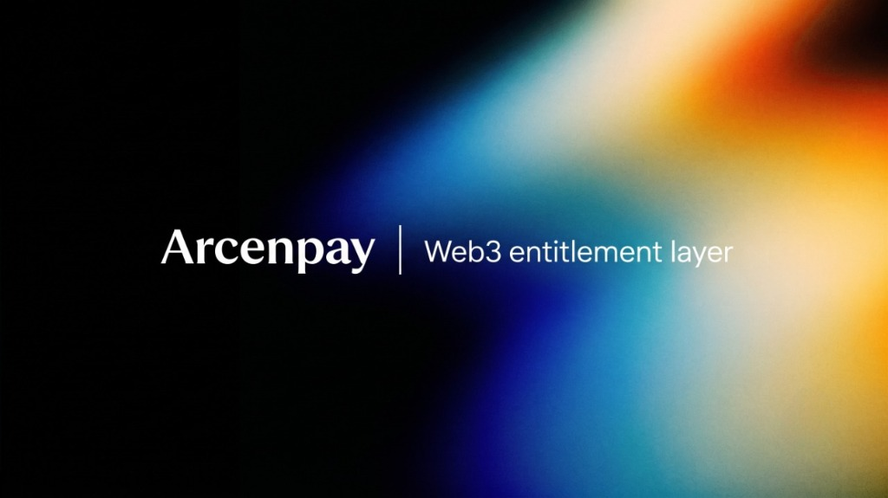

<div align="center">

# ArcenPay

**Enterprise Web3 Entitlement Layer & Autonomous Subscription Billing Platform**

[](./package.json)
[](https://github.com/Arcenpay/Arcenpay/actions/workflows/ci.yml)
[](./.nvmrc)
[](https://docs.arcenpay.com)
[](./tsconfig.base.json)
[](./turbo.json)
[](./LICENSE)

<br />



<br /><br />

[Documentation](https://docs.arcenpay.com) • [Contributing](./CONTRIBUTING.md) • [Security](./SECURITY.md) • [Changelog](./CHANGELOG.md)

</div>

---

## Executive Overview

**ArcenPay** is a production-grade Web3 entitlement and recurring billing platform engineered on the **ArcenPay Protocol** and **ZKVUB settlement architecture**. It bridges on-chain smart contracts (EVM on Base, BOT Chain, Ethereum + Rust Soroban on Stellar, and Solana) with enterprise-grade off-chain billing infrastructure (Hono, Prisma v7, PostgreSQL, and Redis), synchronized in real time via an autonomous facilitator bridge.

ArcenPay provides SaaS operators, Web3 protocols, and AI agent developers with a turn-key billing engine:

- **On-Chain Subscriptions & Smart Accounts:** ERC-7579 Autopay recurring allowances, ERC-20 token streaming, Stellar Soroban subscription registries, and an Anchor program on Solana.
- **Enterprise Entitlement Engine:** Sub-millisecond feature flag evaluations, tiered usage metering, burn-rate allowances, and low-balance event webhooks.
- **Zero-Knowledge Usage Settlement:** Cryptographic batch settlements via Groth16 zk-SNARK circuits without compromising sensitive consumer transaction volumes.
- **Autonomous Agent Commerce:** HTTP 402 payment negotiation, signed payment vouchers, and a client-side x402 flow for autonomous AI agents.
- **Financial Compliance:** Double-entry ledger state, automated proration math, dunning cycle enforcement, ISO 20022 XML compliance, and HMAC-signed PDF invoicing.

---

## Supported Networks & Settlement Currencies

ArcenPay supports multi-chain subscription billing and autonomous agent micropayments natively:

| Network | Chain ID / Type | Settlement Assets | Smart Contract Stack |
| :--- | :--- | :--- | :--- |
| **Base Mainnet** | `8453` (EVM) | USDC, USDT, WETH | ERC-7579 Autopay, SubscriptionRegistry |
| **Base Sepolia** | `84532` (EVM) | Mock USDC | Testnet Staging Suite |
| **BOT Chain Mainnet** | `677` (EVM) | BOT-USDC | High-throughput AI settlement |
| **BOT Chain Testnet** | `968` (EVM) | Test USDC | Bohr Testnet Staging |
| **Ethereum Sepolia** | `11155111` (EVM) | Sepolia USDC | Core Protocol Reference |
| **Arc Testnet** | `5042002` (EVM) | Native Token | Experimental Layer |
| **Stellar Mainnet** | `9000000` (Soroban) | Stellar USDC, Native XLM | Soroban SAC + Subscription Contracts |
| **Stellar Testnet** | `9000001` (Soroban) | Test USDC | Soroban Testnet Environment |
| **Solana Mainnet** | `9100000` (SVM) | USDC, Native SOL | Anchor Subscription Program |
| **Solana Devnet** | `9100001` (SVM) | Devnet USDC | Anchor Devnet Environment |

---

## Core Platform Capabilities

### 1. Zero-Tolerant Idempotency & Financial Precision

Every mutation in the billing lifecycle is deduplicated via deterministic `idempotencyKey` hashes at the ingress layer. All currency calculations are executed in **micro-units** ($1\text{ USDC} = 1{,}000{,}000\text{ micros}$) using arbitrary-precision decimals to prevent floating-point rounding divergence.

### 2. Autonomous Dunning & Proration FSM

- **Mid-Cycle Plan Adjustments:** Immediate computational breakdown of unused time ratio on existing plans against target plans with automated credit note or surcharge invoicing.
- **Grace-Period Dunning Engine:** Transitions accounts from `ACTIVE` to `PAST_DUE` upon payment execution failure. Operates a 7-day grace period with scheduled downgrades to free-tier plans upon expiration.
- **Resilient Recovery Queue:** 4-attempt exponential backoff retry system (`5m` $\rightarrow$ `30m` $\rightarrow$ `2h` $\rightarrow$ `8h`) for blockchain transaction confirmations.

### 3. Autonomous Agent Commerce (x402 Protocol)

The Node SDK ships the client-side x402 machinery that turns AI agents into self-sovereign economic actors:

- **HTTP 402 Handshake:** Intercepts `402 Payment Required` headers, resolves cryptographic pricing parameters, signs vouchers against pre-funded `SessionVault` pools, and resumes request execution automatically.
- **Strict Budget Guardrails:** Configurable limits including `maxAutoApprove`, `maxDailySpend`, and persistent file stores (`FileStore`).

### 4. Enterprise Compliance & Invoicing

- **ISO 20022 XML:** Generates compliant `rem.001.001.07` payment execution records mapping Web3 stablecoins to ISO 4217 standard currency declarations.
- **On-Demand Invoices (Stripe-style):** PDFs are never stored — signed, expiring URLs render the invoice object at request time. Snapshot-aware: issued invoices keep the design they were created with.
- **Invoice Builder (Plus/Pro):** Providers design invoices in the dashboard — logo, brand colors, fonts, watermark, layout sections — with a live preview, protected seeded Classic template, and immutable per-invoice design snapshots.
- **White-Label Embed:** Plus/Pro can remove the "Secured by ArcenPay" badge on their billing embed (server-enforced tier gate); Free always keeps it.
- **Signed Webhook Delivery:** Real-time event notifications signed with HMAC-SHA256 headers (`x-arcenpay-signature`), compatible with standard Svix webhook parsers.

### 5. Stripe-Style Credentials (`sk_` / `pk_` / `rk_` / `arc_tok_`)

- **Secret keys** (`sk_live_/sk_test_`) for the Node SDK, **publishable keys** (`pk_live_/pk_test_`) for the browser React SDK, and **restricted keys** (`rk_`) with fine-grained permissions (`payments.write`, `entitlements.read`, …).
- **Hashed-at-rest, shown-once** credential lifecycle with `expiresAt`, `revokedAt`, `lastUsedAt` and test/live environment prefixes.
- **Temporary access tokens** (`arc_tok_…`, 60–900s) minted server-side for company-scoped browser sessions — no secret ever touches the client.

### 6. Cloudflare R2 Object Storage

- Pluggable `ObjectStore` with an **R2 driver** (S3-compatible, SigV4 validated against the official AWS test vector, zero SDK dependency) and a local filesystem fallback (`STORAGE_DRIVER=r2|local`).
- Logos and future assets store in R2; invoice PDFs stay fully on-demand.

---

## SDK Suite (v1.2.0)

ArcenPay distributes tree-shakeable, TypeScript-native SDK packages:

### 1. Browser Client — `@arcenpay/react`

```bash
npm install @arcenpay/react
```

```tsx
import { ArcenPayProvider, ArcenEmbed, useEntitlement } from "@arcenpay/react";

export function App() {
  return (
    <ArcenPayProvider publishableKey={process.env.NEXT_PUBLIC_ARCENPAY_KEY}>
      <BillingModal />
    </ArcenPayProvider>
  );
}

function BillingModal() {
  const { hasAccess, loading } = useEntitlement("team_123", "enterprise-analytics");
  return <ArcenEmbed mode="modal" componentId="cmp_pricing_table" />;
}
```

### 2. Server Client — `@arcenpay/node`

```bash
npm install @arcenpay/node
```

```typescript
import { ArcenClient, verifyWebhookSignature } from "@arcenpay/node";

const client = new ArcenClient({ apiKey: process.env.ARCENPAY_API_KEY! });

// Verify entitlement access
const access = await client.checkEntitlement("enterprise-analytics", {
  id: "company_123"
});

// Verify incoming webhook
const isValid = verifyWebhookSignature(payload, signature, process.env.WEBHOOK_SECRET!);
```

---

## Repository Layout

This repository is managed with [Turborepo](https://turbo.build/) and structured across modular application and library boundaries:

```
arcenpay/
├── apps/
│   ├── arcen-dashboard/       # Provider Control Plane (Next.js 16 App Router, Tailwind CSS)
│   └── arcen-backend/         # Core Billing Engine & REST API (Hono v4, Prisma v7, PostgreSQL)
├── packages/
│   ├── sdk-react/             # @arcenpay/react — Frontend UI components & React hooks
│   ├── sdk-node/              # @arcenpay/node — Server SDK, webhooks & x402 middleware
│   ├── shared-types/          # @arcenpay/shared-types — API envelopes & DTO contracts
│   ├── internal-core/         # @arcenpay/internal-core — Shared runtime (chains, ABIs, addresses)
│   └── solana-programs/       # Anchor subscription program for Solana
├── circuits/                  # ZKVUB zk-SNARK Circuits (Groth16 via Circom & SnarkJS)
├── scripts/                   # Ops, migration, and release tooling
├── docker-compose.yml         # Local infrastructure (PostgreSQL 16, Redis 7)
└── turbo.json                 # Monorepo build, test, and typecheck dependency pipelines
```

---

## Local Development & Operations

### Prerequisites

- **Node.js:** `>= 20.0.0`
- **Package Manager:** `npm >= 10.0.0`
- **Container Runtime:** Docker Desktop or Docker Engine
- **Rust / Solana (optional, for the Anchor program):** `cargo` and `anchor`

### Quick Setup

```bash
# 1. Clone repository and install dependencies
git clone https://github.com/Arcenpay/Arcenpay.git
cd Arcenpay
npm ci

# 2. Configure environment
cp .env.example .env

# 3. Spin up PostgreSQL (:5433) and Redis (:6380)
docker compose up -d

# 4. Generate Prisma clients and build all workspaces
npm run build
```

### Local Services & Port Reference

| Service | Workspace | Command | Local URL |
| :--- | :--- | :--- | :--- |
| **Provider Dashboard** | `apps/arcen-dashboard` | `npm run dev:dashboard` | `http://localhost:3000` |
| **Backend REST API** | `apps/arcen-backend` | `npm run dev:backend` | `http://localhost:3300` |
| **PostgreSQL 16** | Docker Engine | `docker compose up -d` | `localhost:5433` |
| **Redis 7** | Docker Engine | `docker compose up -d` | `localhost:6380` |

---

## Development & Release Commands

### Verification & Quality Gates

All pull requests must satisfy these quality gates prior to merging:

```bash
# Build the shared packages the SDKs depend on
npm run build --workspace=@arcenpay/internal-core
npm run build --workspace=@arcenpay/shared-types

# Verify the vendored internal/core copies match the source of truth
npm run check:core-sync

# Typecheck and test the SDK packages
npm run typecheck:sdk
npm run test:sdk

# Verify unfinished work gate (prohibits TODOs/FIXMEs/stubs in first-party code)
bash scripts/check-unfinished.sh
```

### SDK Publishing Protocol

To publish the SDK packages to the npm registry:

```bash
# 1. Verify authentication
npm whoami

# 2. Perform build, test, typecheck, and dry-run pack verification
npm run publish:sdk:dry-run

# 3. Release packages publicly to npm (@arcenpay/react, @arcenpay/node)
npm run publish:sdk
```

---

## Security & Disclosure

ArcenPay handles mission-critical financial transactions and entitlement authorizations. We adhere to responsible security practices:

- **Private Keys & Secrets:** Neither the backend nor the provider dashboard ever stores non-custodial consumer private keys.
- **Smart Contract Audits:** Contract code across `packages/internal-core` and the on-chain programs uses formal verification and OpenZeppelin upgradeable standards.
- **Security Inquiries:** To report a potential vulnerability, please email **security@arcenpay.com** rather than opening a public issue. See [SECURITY.md](./SECURITY.md).

---

## License

Proprietary. Copyright © 2026 ArcenPay Inc. All rights reserved.

Unauthorized copying, modification, or distribution of this software is strictly prohibited without prior written permission. See [LICENSE](./LICENSE) for the full terms.
